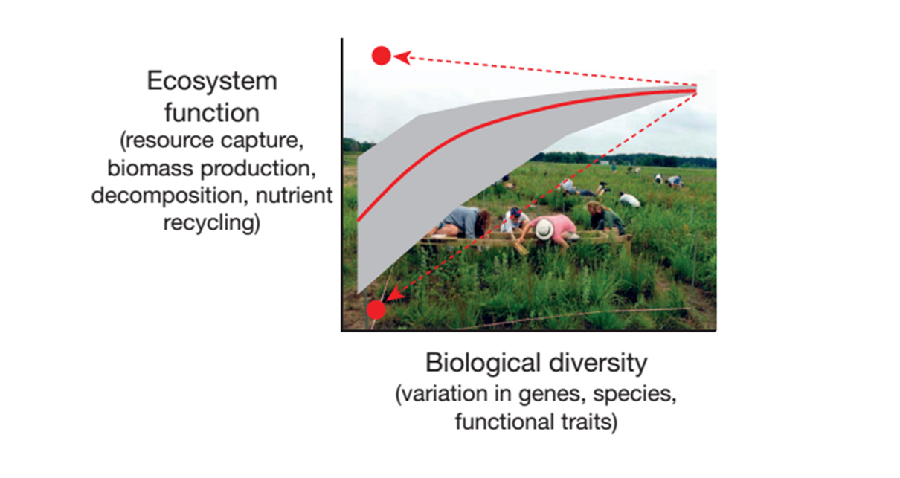
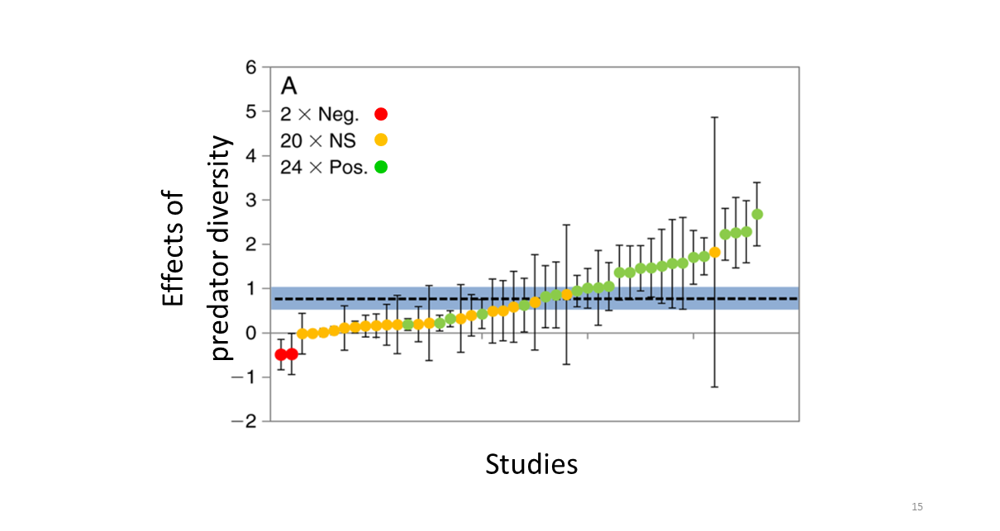
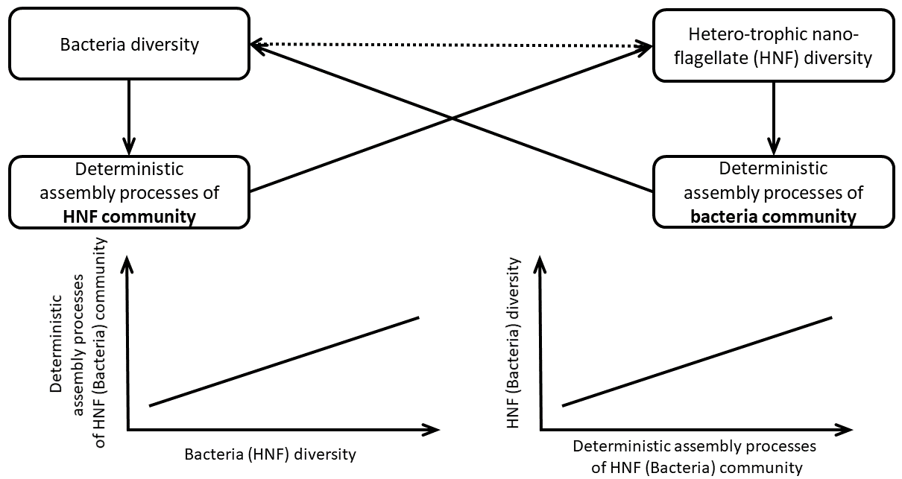
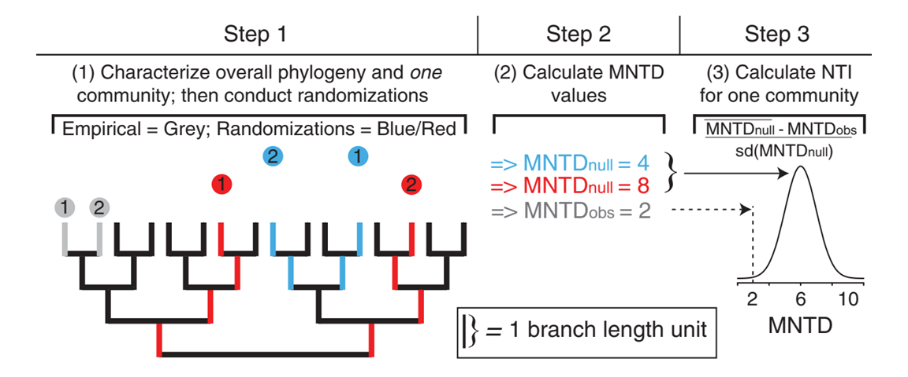
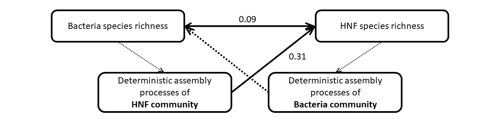
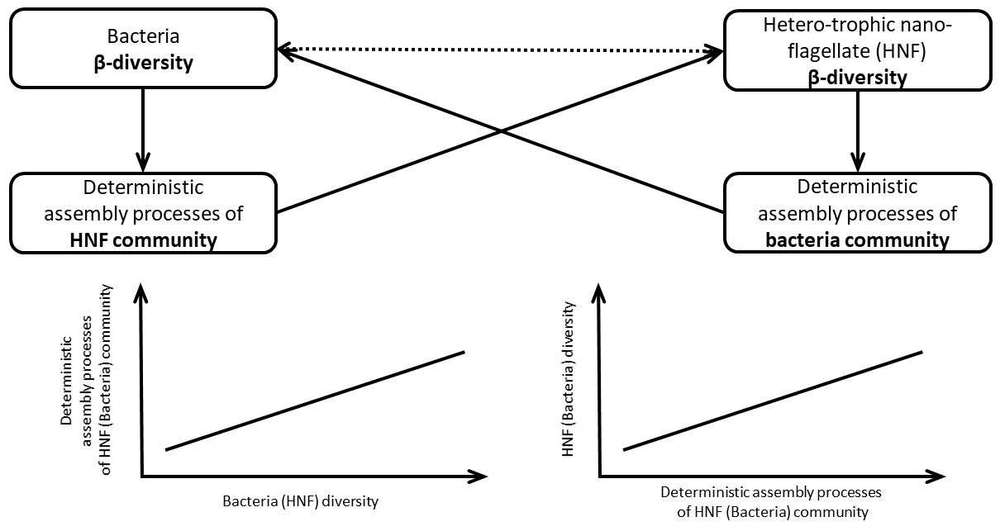

```{r setup, include=FALSE}
library(knitr)
opts_chunk$set(echo = FALSE)
```

# 
<style>
  p.caption {font-size: 0.6em; text-align: right}
}
</style>

```{r positiveBEF, fig.cap = "Cardinale et al. 2012 @ Nature", fig.align = 'center', out.width = "75%"}

``` 

#

```{r consumerBEF, fig.cap = "Griffin et al. 2013 @ Ecology", fig.align = 'center', out.width = "75%"}

``` 

# 

The effects of **predator diversity** and **prey diversity** are coufounded

```{r PdPyDiv_EF, fig.align = 'center', out.width = "75%"}
include_graphics("PdPyDiv_EF.png")
``` 

# Why is the predator diversity and prey diversity related?

Hypothesis:

The predator-prey diversity relationship would be driven by **the strength of deterministic assembly processes**.

- Predator : hetero-trophic nano-flagellate
- Predator : bacteria

```{r, message=FALSE, fig.width = 7, fig.height = 5}
St_sECS = read.table(file = "https://raw.githubusercontent.com/OscarFHC/PdPy_Div/master/data/raw/St_Location.csv", 
                     header = T, fill = T, sep = ",")
library(ggmap)
library(mapproj)
bbox <- ggmap::make_bbox(Lon, Lat, St_sECS, f = 0.1)
map <- get_map(
  location = bbox #c(lon=-85, lat=44) # google search string
  #, zoom = 7 # larger is closer
  #, maptype = "terrian" # map type
  , source = "google"
)
p = ggmap(map) + 
  geom_point(data = St_sECS[1:7,], aes(x = Lon, y = Lat), size = 4) + 
  labs(x="Longitude", y="Latitude") + 
  geom_text(data = St_sECS[1:7,], aes(x = Lon, y = Lat, label = Station), hjust = -0.4, vjust = -0.3, size = 4) + 
  theme(axis.title = element_text(size = 18),
        axis.text = element_text(size = 14))
p
```

#

```{r Hypo, fig.align = 'center', out.width = "75%"}

``` 

# Deterministic assembly processes

- Environmental filtering and/or other species interactions (e.g. predation)

- Counter part of stochasticity (randomness)

- Indicated by Between-assemblage **N**earest **T**axon **I**ndex ($\beta NTI$)

#
  
$$\beta NTI = \frac{\beta MNTD_{obs} - \overline{\beta MNTD_{null}}}{sd(\beta MNTD_{null})}$$,  where $\beta MNTD_{null}$ is the null distribution of between-assemblage mean nearest taxon distance.

```{r bNTI, fig.cap = "Stegen et al. 2012 @ ISME", fig.align = 'center', out.width = "75%"}

``` 

- The more $\beta NTI$ deviated from the null, the stronger the deterministic assembly processes is. 

# Bacteria-HNF diversity relationships

# Bacteria diversity $\rightarrow$ HNF $\beta NTI$ $\rightarrow$ HNF diversity

```{r, fig.cap = "", fig.align = 'center', out.width = "90%"}
include_graphics("p_Bacq0_HNFSelect_HNFq0.png")
``` 

# HNF diversity $\rightarrow$ bacteria $\beta NTI$ $\rightarrow$ bacteria diversity

```{r, fig.cap = "", fig.align = 'center', out.width = "90%"}
include_graphics("p_HNFq0_BacSelect_Bacq0.png")
``` 

# Path model

```{r, fig.cap = "", fig.align = 'center', out.width = "90%"}

``` 

# $\beta NTI$ might be more informative to $\beta$ diversity

```{r, fig.cap = "", fig.align = 'center', out.width = "75%"}

``` 


- **Generalized additive model** is a <mark> generalized </mark> linear model with a linear predictor, involving a sum of smooth functions of covariates.

$g(u_i) = X^*_i \theta + f_1(x_{1i}) + f_2(x_{2i}) + f_3(x_{3i}, x_{4i}) + ...$ (eqn. 3.1)

- GAM specifies the model with **smooth functions** rather than detailed parametric relationships.


# Univariate smooth functions $f$

$y_i = f(x_i) + \epsilon_i$ (eqn. 3.2)

$y_i$ : response variable \
$f$ : **smooth function** \
$x_i$ : covariate \
$\epsilon_i$ : i.i.d. $N(0, \sigma^2)$ variable (error) \

- Represent the smooth function *f* in a way that (eqn. 3.2) becomes a linear model. 
- The smooth function *f* can then be expressed as some \
  *basis functions* $(b)$ with parameter $\beta$
  
$f(x_i) = \sum_{j=1}^{q} b_j(x)\beta_j$


# Simple example of smooth function: 4<sup>th</sup> order polynomial basis

$f(x) = \beta_1 + x\beta_2 + x^2\beta_3 + x^3\beta_4 + x^4\beta_5$


# 
A cubic spline basis can be expressed as...

$b_1(x)=1, b_2(x)=x,...,b_{i+2}(x,x_k^*)$

- Consist of *one constant*, *one 1<sup>st</sup> order (linear)* term, and $k$ cubic polynomials

  - **$k$ is the number of knots**
  - knots are evenly spaced or at the quantile of distribution of x ($x_i^*; i = 1 \sim k$)
  - $k+2$ is the rank of the cubic spline function

- $b_{i+2}(x,x_k^*)$ is a cubic polynomial written as:

