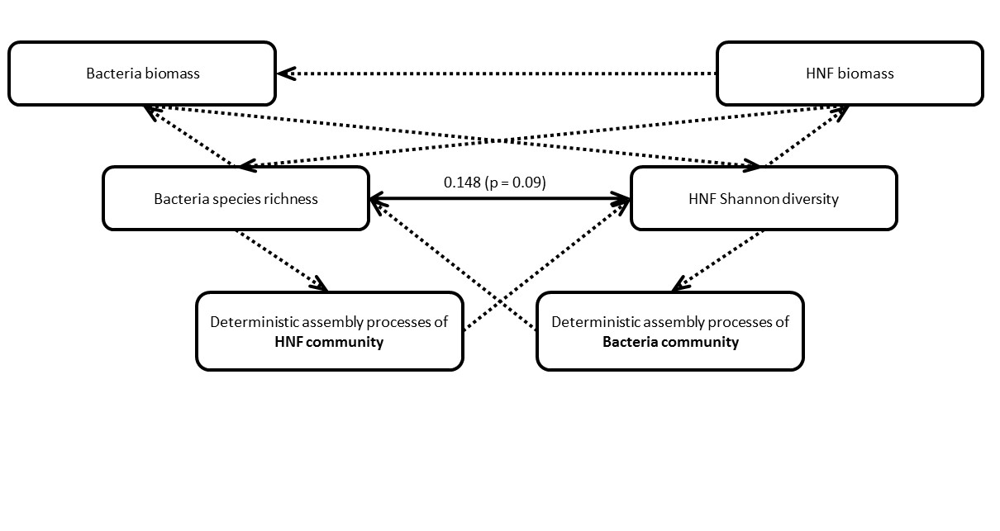

```{r, set global theme, include=FALSE}
knitr::opts_chunk$set(fig.width = 12, fig.height = 12)
```

```{r, library loading, echo = FALSE, message = FALSE}
if (!require(knitr)) {
  install.packages("knitr", dependencies=TRUE, repos = 'http://cran.us.r-project.org')
  library(knitr)
}else{library(knitr)}

if (!require(tidyverse)) {
  install.packages("tidyverse", dependencies=TRUE, repos = 'http://cran.us.r-project.org')
  library(tidyverse)
}else{library(tidyverse)}

if (!require(vegan)) {
  install.packages("vegan", dependencies=TRUE, repos = 'http://cran.us.r-project.org')
  library(vegan)
}else{library(vegan)}

if (!require(mgcv)) {
  install.packages("mgcv", dependencies=TRUE, repos = 'http://cran.us.r-project.org')
  library(mgcv)
}else{library(mgcv)}

if (!require(ape)) {
  install.packages("ape", dependencies=TRUE, repos = 'http://cran.us.r-project.org')
  library(ape)
}else{library(ape)}

if (!require(parallel)) {
  install.packages("vegan", dependencies=TRUE, repos = 'http://cran.us.r-project.org')
  library(parallel)
}else{library(parallel)}

if (!require(SpadeR)) {
  install.packages("SpadeR", dependencies=TRUE, repos = 'http://cran.us.r-project.org')
  library(SpadeR)
}else{library(SpadeR)}

if (!require(iNEXT)) {
  install.packages("iNEXT", dependencies=TRUE, repos = 'http://cran.us.r-project.org')
  library(iNEXT)
}else{library(iNEXT)}

if (!require(picante)) {
  install.packages("picante", dependencies=TRUE, repos = 'http://cran.us.r-project.org')
  library(picante)
}else{library(picante)}

if (!require(geiger)) {
  install.packages("geiger", dependencies=TRUE, repos = 'http://cran.us.r-project.org')
  library(geiger)
}else{library(geiger)}

if (!require(GUniFrac)) {
  install.packages("GUniFrac", dependencies=TRUE, repos = 'http://cran.us.r-project.org')
  library(GUniFrac)
}else{library(GUniFrac)}

if (!require(phytools)) {
  install.packages("phytools", dependencies=TRUE, repos = 'http://cran.us.r-project.org')
  library(phytools)
}else{library(phytools)}

if (!require(ecodist)) {
  install.packages("ecodist", dependencies=TRUE, repos = 'http://cran.us.r-project.org')
  library(ecodist)
}else{library(ecodist)}

if (!require(ade4)) {
  install.packages("ade4", dependencies=TRUE, repos = 'http://cran.us.r-project.org')
  library(ade4)
}else{library(ade4)}

if (!require(lavaan)) {
  install.packages("lavaan", dependencies=TRUE, repos = 'http://cran.us.r-project.org')
  library(lavaan)
}else{library(lavaan)}

if (!require(semTools)) {
  install.packages("semTools", dependencies=TRUE, repos = 'http://cran.us.r-project.org')
  library(semTools)
}else{library(semTools)}

if (!require(psych)) {
  install.packages("psych", dependencies=TRUE, repos = 'http://cran.us.r-project.org')
  library(psych)
}else{library(psych)}

if (!require(plspm)) {
  install.packages("plspm", dependencies=TRUE, repos = 'http://cran.us.r-project.org')
  library(plspm)
}else{library(plspm)}

if (!require(nlme)) {
  install.packages("nlme", dependencies=TRUE, repos = 'http://cran.us.r-project.org')
  library(nlme)
}else{library(nlme)}

if (!require(piecewiseSEM)) {
  install.packages("piecewiseSEM", dependencies=TRUE, repos = 'http://cran.us.r-project.org')
  library(piecewiseSEM)
}else{library(piecewiseSEM)}

if (!require(brms)) {
  install.packages("brms", dependencies=TRUE, repos = 'http://cran.us.r-project.org')
  library(brms)
}else{library(brms)}

if (!require(blavaan)) {
  install.packages("blavaan", dependencies=TRUE, repos = 'http://cran.us.r-project.org')
  library(blavaan)
}else{library(blavaan)}

if (!require(rstanarm)) {
  install.packages("rstanarm", dependencies=TRUE, repos = 'http://cran.us.r-project.org')
  library(rstanarm)
}else{library(rstanarm)}

library("rstan")
options(mc.cores = parallel::detectCores())
rstan_options(auto_write = TRUE)

if (!require(loo)) {
  install.packages("loo", dependencies=TRUE, repos = 'http://cran.us.r-project.org')
  library(loo)
}else{library(loo)}

if (!require(lmodel2)) {
  install.packages("lmodel2", dependencies=TRUE, repos = 'http://cran.us.r-project.org')
  library(lmodel2)
}else{library(lmodel2)}

if (!require(abind)) {
  install.packages("abind", dependencies=TRUE, repos = 'http://cran.us.r-project.org')
  library(abind)
}else{library(abind)}

if (!require(ggplot2)) {
  install.packages("ggplot2", dependencies=TRUE, repos = 'http://cran.us.r-project.org')
  library(ggplot2)
}else{library(ggplot2)}

if (!require(viridis)) {
  install.packages("viridis", dependencies=TRUE, repos = 'http://cran.us.r-project.org')
  library(viridis)
}else{library(viridis)}

if (!require(GGally)) {
  install.packages("GGally", dependencies=TRUE, repos = 'http://cran.us.r-project.org')
  library(GGally)
}else{library(GGally)}

if (!require(cowplot)) {
  install.packages("cowplot", dependencies=TRUE, repos = 'http://cran.us.r-project.org')
  library(cowplot)
}else{library(cowplot)}
```

```{r, read in data, echo = FALSE}
Bac_comm <- as.data.frame(t(read.table(file = "https://raw.githubusercontent.com/OscarFHC/PdPy_Div/master/data/16s_seqXst.csv",
                                       sep = ",", header = TRUE, row.names = 1, stringsAsFactors = FALSE, fill = TRUE)))
Bac_ra_comm <- Bac_comm / rowSums(Bac_comm)
Bac_phylo<- read.tree(file = "https://raw.githubusercontent.com/OscarFHC/PdPy_Div/master/data/treeNJ_16s.tree")

NF_comm <- as.data.frame(t(read.table(file = "https://raw.githubusercontent.com/OscarFHC/PdPy_Div/master/data/prot_seqXst_PR2.csv", 
                                      sep = ",", header = TRUE, row.names = 1, stringsAsFactors = FALSE, fill = TRUE)))
NF_ra_comm <- NF_comm / rowSums(NF_comm)
NF_phylo<- read.tree(file = "https://raw.githubusercontent.com/OscarFHC/PdPy_Div/master/data/prot_treeNJ_PR2.tree")

HNF_comm <- as.data.frame(t(read.table(file = "https://raw.githubusercontent.com/OscarFHC/PdPy_Div/master/data/HNF_seqXst_PR2.csv",
                                       sep = ",", header = TRUE, row.names = 1, stringsAsFactors = FALSE, fill = TRUE)))
HNF_ra_comm <- HNF_comm / rowSums(HNF_comm)
HNF_phylo<- read.tree(file = "https://raw.githubusercontent.com/OscarFHC/PdPy_Div/master/data/HNF_treeNJ_PR2.tree")

Vars <- read.table(file = "https://raw.githubusercontent.com/OscarFHC/PdPy_Div/master/data/sECS_Vars.csv", sep = ",", 
                   header = TRUE, stringsAsFactors = FALSE, fill = TRUE)
```

```{r, reading nulls, echo = FALSE}
Bac_MNTD_null <- read.table(file = "D:/Research/PdPy_Div_Results/Bac_MNTD_null.csv", sep = ",", 
                            header = TRUE, stringsAsFactors = FALSE, fill = TRUE)
Bac_MNTD <- Bac_MNTD_null %>% 
  select(c(obs, Var1, Var2)) %>%
  mutate(MNTD_null_mean = apply(Bac_MNTD_null[, !names(Bac_MNTD_null) %in% c("obs", "Var1", "Var2")], 1, mean),
         MNTD_null_sd = apply(Bac_MNTD_null[, !names(Bac_MNTD_null) %in% c("obs", "Var1", "Var2")], 1, sd),
         Bac_select_strength = (obs - MNTD_null_mean) / MNTD_null_sd,
         Bac_select_p = pnorm(-abs(Bac_select_strength), 0, 1))

Bac_Chao_null <- read.table(file = "D:/Research/PdPy_Div_Results/Bac_Chao_null.csv", sep = ",", 
                            header = TRUE, stringsAsFactors = FALSE, fill = TRUE)
Bac_BDiv_Chao <- Bac_Chao_null %>% 
  select(c(obs, Var1, Var2)) %>%
  mutate(Chao_null_mean = apply(Bac_Chao_null[, !names(Bac_Chao_null) %in% c("obs", "Var1", "Var2")], 1, mean),
         Chao_null_sd = apply(Bac_Chao_null[, !names(Bac_Chao_null) %in% c("obs", "Var1", "Var2")], 1, sd),
         Bac_disp_strength = (obs - Chao_null_mean) / Chao_null_sd,
         Bac_disp_p = pnorm(Bac_disp_strength, 0, 1))

HNF_MNTD_null <- read.table(file = "D:/Research/PdPy_Div_Results/HNF_MNTD_null_PR2.csv", sep = ",", 
                            header = TRUE, stringsAsFactors = FALSE, fill = TRUE)
HNF_MNTD <- HNF_MNTD_null %>% select(c(obs, Var1, Var2)) %>%
  mutate(MNTD_null_mean = apply(HNF_MNTD_null[, !names(HNF_MNTD_null) %in% c("obs", "Var1", "Var2")], 1, mean),
         MNTD_null_sd = apply(HNF_MNTD_null[, !names(HNF_MNTD_null) %in% c("obs", "Var1", "Var2")], 1, sd),
         HNF_select_strength = (obs - MNTD_null_mean) / MNTD_null_sd,
         HNF_select_p = pnorm(-abs(HNF_select_strength), 0, 1))
HNF_Chao_null <- read.table(file = "D:/Research/PdPy_Div_Results/HNF_Chao_null_PR2.csv", sep = ",", 
                            header = TRUE, stringsAsFactors = FALSE, fill = TRUE)
HNF_BDiv_Chao <- HNF_Chao_null %>% 
  select(c(obs, Var1, Var2)) %>%
  mutate(Chao_null_mean = apply(HNF_Chao_null[, !names(HNF_Chao_null) %in% c("obs", "Var1", "Var2")], 1, mean),
         Chao_null_sd = apply(HNF_Chao_null[, !names(HNF_Chao_null) %in% c("obs", "Var1", "Var2")], 1, sd),
         HNF_disp_strength = (obs - Chao_null_mean) / Chao_null_sd,
         HNF_disp_p = pnorm(HNF_disp_strength, 0, 1))
```

```{r, reading functions, echo = FALSE}
cor_fun <- function(data, mapping, method="pearson", ndp=2, sz=5, stars=TRUE, ...){
  
  x <- eval_data_col(data, mapping$x)
  y <- eval_data_col(data, mapping$y)
  
  corr <- cor.test(x, y, method = method)
  est <- corr$estimate
  lb.size <- 6#sz* abs(est) 
  
  if(stars){
    stars <- c("***", "**", "*", "")[findInterval(corr$p.value, c(0, 0.001, 0.01, 0.05, 1))]
    lbl <- paste0(round(est, ndp), stars)
  }else{
    lbl <- round(est, ndp)
  }
  
  ggplot(data = data, mapping = mapping) + 
    annotate("text", x = mean(x, na.rm = TRUE), y = mean(y, na.rm = TRUE), label = lbl, size = lb.size, ...)+
    theme(panel.grid = element_blank())
}

fit_fun <- function(data, mapping, ...){
  p <- ggplot(data = data, mapping = mapping) + 
    geom_point() + 
    geom_smooth(method = loess, fill = "red", color = "red", ...) +
    geom_smooth(method = lm, fill = "blue", color = "blue", ...)
  p
}
```

```{r, preping data, echo = FALSE}
Bac_A <- iNEXT(t(Bac_comm), q = 0, datatype = "abundance", size = max(colSums(Bac_comm)) + 100000)$AsyEst %>% 
  select(Site, Diversity, Estimator) %>% 
  spread(Diversity, Estimator) %>%
  rename(Bac_q0 = "Species richness", Bac_q1 = "Shannon diversity", Bac_q2 = "Simpson diversity") %>%
  mutate(Site = rownames(Bac_comm))

HNF_A <- iNEXT(t(HNF_comm), q = 0, datatype = "abundance", size = max(colSums(HNF_comm)) + 100000)$AsyEst %>% 
  select(Site, Diversity, Estimator) %>% 
  spread(Diversity, Estimator) %>%
  rename(HNF_q0 = "Species richness", HNF_q1 = "Shannon diversity", HNF_q2 = "Simpson diversity") %>%
  mutate(Site = rownames(HNF_comm))

Bac_selec <- Bac_MNTD %>%
  # filter(Bac_select_p < 0.05) %>%
  group_by(Var2) %>%
  summarize(Bac_select = mean(Bac_select_strength, na.rm = TRUE))

HNF_selec <- HNF_MNTD %>%
  # filter(HNF_select_p < 0.05) %>%
  group_by(Var2) %>%
  summarize(HNF_select = mean(HNF_select_strength, na.rm = TRUE))

HNF_Bac_A <- Bac_selec %>%
  inner_join(HNF_selec, by = c("Var2" = "Var2")) %>%
  inner_join(Bac_A, by = c("Var2" = "Site")) %>%
  inner_join(HNF_A, by = c("Var2" = "Site")) %>%
  inner_join(Vars, by = c("Var2" = "SampleID")) %>%
  filter(!is.na(NF_Biom)) %>%
  mutate(ln.Bac_q0 = log(Bac_q0),
         ln.HNF_q0 = log(HNF_q0),
         ln.Bac_q1 = log(Bac_q1),
         ln.HNF_q1 = log(HNF_q1),
         ln.Bac_q2 = log(Bac_q2),
         ln.HNF_q2 = log(HNF_q2),
         ln.Bac_Biom = log(Bac_Biom),
         ln.HNF_Biom = log(HNF_Biom),
         ln.Bac_select = log(Bac_select - min(Bac_select) + 0.1),
         ln.HNF_select = log(HNF_select - min(HNF_select) + 0.1),
         ln.Temp = log(Temp),
         ln.Sal = log(Sal),
         ln.PAR = log(PAR),
         ln.NO2 = log(NO2 + 0.0001),
         ln.NO3 = log(NO3 + 0.0001),
         ln.DIN = log(DIN + 0.0001),
         ln.PO3 = log(PO3 + 0.0001), 
         ln.Chla = log(Chla + 0.00001))
HNF_Bac_A <- as.data.frame(HNF_Bac_A)
```

# Overaching question

Why is the predator and prey diversity related?

# Hypothesis

The predator-prey diversity relationship would be driven by *the strength of deterministic assembly processes.*


# Deterministic assembly processes ($\beta NTI$)

- Indicated by Between-assemblage **N**earest **T**axon **I**ndex ($\beta NTI$)
  
$$\beta NTI = \frac{\beta NTI_{obs} - \overline{\beta MNTD_{null}}}{sd(\beta MNTD_{null})}$$,  where $\beta MNTD_{null}$ is the null distribution of between-assemblage mean nearest taxon distance.

- The more $\beta NTI$ deviated from the null, the stronger the deterministic assembly processes is. 

# EXploratory Data analyses

## Pairwise predator (HNF)-prey (bacteria) diversity relationship

```{r, Diversity pairs, echo = FALSE}
p_Adiv_pairs <- HNF_Bac_A %>%
  ggpairs(columns = c("ln.Bac_q0", "ln.HNF_q0", "ln.Bac_q1", "ln.HNF_q1", "ln.Bac_q2", "ln.HNF_q2"),
                      #"ln.Bac_Biom", "ln.HNF_Biom", "Bac_select", "HNF_select"),
          columnLabels = c("Bacteria\nspecies\nrichness", "HNF\nspecies\nrichness",
                           "Bacteria\nShannon\ndiversity", "HNF\nShannon\ndiversity", 
                           "Bacteria\nSimpson\ndiversity", "HNF\nSimpson\ndiversity"), 
                           #"log(Bacteria\nbiomass)", "log(HNF\nbiomass)", "Bacteria\nselection", "HNF\nselection"),
          #mapping = ggplot2::aes(colour = Cruise),
          upper = list(continuous = cor_fun),
          lower = list(continuous = fit_fun)) +
  theme(strip.text.x = element_text(color = "black", size = 14),
        strip.text.y = element_text(angle = 45, color = "black", size = 14))
p_Adiv_pairs
```

Bacteria species richness (*BacSR*) is positively related to all three HNF diversity indices and those relationships seem to be non-linear. However, Bacteria Shannon and Simpson diversity are not significantly related to any diversity indices of HNF so could be omitted from the following analyses. 

## Predator-prey diversity indices V.S. $\beta NTI$

```{r, Diversity selection biomass, echo = FALSE}
p_Adiv_pairs_select <- HNF_Bac_A %>%
  ggpairs(columns = c("ln.Bac_q0", "ln.HNF_q0", "ln.HNF_q1", "ln.HNF_q2",  
                      "ln.Bac_Biom", "ln.HNF_Biom", "Bac_select", "HNF_select"),
          columnLabels = c("Bacteria\nspecies\nrichness", 
                           "HNF\nspecies\nrichness", "HNF\nShannon\ndiversity", "HNF\nSimpson\ndiversity", 
                           "log(Bacteria\nbiomass)", "log(HNF\nbiomass)", "Bacteria\nselection", "HNF\nselection"),
          #mapping = ggplot2::aes(colour = Cruise),
          upper = list(continuous = cor_fun),
          lower = list(continuous = fit_fun)) +
  theme(strip.text.x = element_text(color = "black", size = 14),
        strip.text.y = element_text(angle = 45, color = "black", size = 14))
p_Adiv_pairs_select
```

# HNF species richness V.S. Bacteria species richness

## Linear model

```{r, echo = FALSE}
p_Bacq0_HNFSelect <- HNF_Bac_A %>% 
  select(ln.Bac_q0, ln.HNF_q0, Bac_select, HNF_select, Cruise) %>%
  ggplot(aes(x = ln.Bac_q0, y = HNF_select)) + 
  geom_point(aes(color = Cruise), size = 3) + 
  geom_smooth(formula = y ~ x, method = "lm", se = TRUE, linetype = "dotted") + 
  geom_smooth(method = mgcv::gam, formula = y ~ s(x), se = TRUE, color = "red", linetype = "dotted") + 
  scale_colour_viridis(alpha = 0.7, discrete=TRUE) + 
  labs(x = expression("Log[ Bacteria species richness (Hill number = 0) ]"),
       y = expression(paste("Deterministic assembly processes (", "\U03B2", "NTI) ", "of HNF community "))) + 
  theme(axis.text = element_text(size = 12),
        axis.title = element_text(size = 16))

p_HNFq1_BacSelect <- HNF_Bac_A %>% 
  select(ln.Bac_q0, ln.HNF_q1, Bac_select, HNF_select, Cruise) %>%
  ggplot(aes(x = ln.HNF_q1, y = Bac_select)) + 
  geom_point(aes(color = Cruise), size = 3) + 
  geom_smooth(formula = y ~ x, method = "lm", se = TRUE, linetype = "dotted") + 
  geom_smooth(method = mgcv::gam, formula = y ~ s(x), se = TRUE, color = "red", linetype = "dotted") + 
  scale_colour_viridis(alpha = 0.7, discrete=TRUE) + 
  labs(x = expression("Log[ HNF species richness (Hill number = 0) ]"),
       y = expression(paste("Deterministic assembly processes (", "\U03B2", "NTI) ", "of Bacteria community "))) + 
  theme(axis.text = element_text(size = 12),
        axis.title = element_text(size = 16))

legend <- get_legend(
  p_Bacq0_HNFSelect + theme(legend.box.margin = margin(0, 0, 0, 12))
)

p_Bacq1_HNFq0_Select <- plot_grid(
  plot_grid(p_Bacq0_HNFSelect + theme(legend.position="none"),
            p_HNFq1_BacSelect + theme(legend.position="none")),
  legend, rel_widths = c(3, .4))
p_Bacq1_HNFq0_Select
```

```{r, echo = FALSE}
p_BacSelect_Bacq0 <- HNF_Bac_A %>% 
  select(ln.Bac_q0, ln.HNF_q0, Bac_select, HNF_select, Cruise) %>%
  ggplot(aes(x = Bac_select, y = ln.Bac_q0)) + 
  geom_point(aes(color = Cruise), size = 3) + 
  geom_smooth(formula = y ~ x, method = "lm", se = TRUE, linetype = "dotted") + 
  geom_smooth(method = mgcv::gam, formula = y ~ s(x), se = TRUE, color = "red", linetype = "dotted") + 
  scale_colour_viridis(alpha = 0.7, discrete=TRUE) + 
  labs(x = expression(atop(paste("Deterministic assembly processes (\U03B2", "NTI)"), "of Bacteria community ")),
       y = expression("Log[ Bacteria species richness (Hill number = 0) ]")) + 
  theme(axis.text = element_text(size = 12),
        axis.title = element_text(size = 16))

p_HNFSelect_HNFq0 <- HNF_Bac_A %>% 
  select(ln.Bac_q0, ln.HNF_q0, Bac_select, HNF_select, Cruise) %>%
  ggplot(aes(x = HNF_select, y = ln.HNF_q0)) + 
  geom_point(aes(color = Cruise), size = 3) + 
  geom_smooth(formula = y ~ x, method = "lm", se = TRUE, linetype = "dotted") + 
  geom_smooth(method = mgcv::gam, formula = y ~ s(x), se = TRUE, color = "red", linetype = "dotted") + 
  scale_colour_viridis(alpha = 0.7, discrete=TRUE) + 
  labs(x = expression(atop(paste("Deterministic assembly processes (\U03B2", "NTI)"), "of HNF community ")),
       y = expression("Log[ HNF species richness (Hill number = 0) ]")) + 
  theme(axis.text = element_text(size = 12),
        axis.title = element_text(size = 16))

legend <- get_legend(
  p_BacSelect_Bacq0 + theme(legend.box.margin = margin(0, 0, 0, 12))
)
p_Select_Bacq0_HNFq0 <- plot_grid(
  plot_grid(p_BacSelect_Bacq0 + theme(legend.position="none"),
            p_HNFSelect_HNFq0 + theme(legend.position="none")),
  legend, rel_widths = c(3, .4))
p_Select_Bacq0_HNFq0
```


## Path analyses to include bacteria and HNF biomass and other environmental variables


# HNF Shannon diversity V.S. Bacteria species richness

## Linear model

```{r, echo = FALSE}
p_Bacq0_HNFSelect <- HNF_Bac_A %>% 
  select(ln.Bac_q0, ln.HNF_q0, Bac_select, HNF_select, Cruise) %>%
  ggplot(aes(x = ln.Bac_q0, y = HNF_select)) + 
  geom_point(aes(color = Cruise), size = 3) + 
  geom_smooth(formula = y ~ x, method = "lm", se = TRUE, linetype = "dotted") + 
  geom_smooth(method = mgcv::gam, formula = y ~ s(x), se = TRUE, color = "red", linetype = "dotted") + 
  scale_colour_viridis(alpha = 0.7, discrete=TRUE) + 
  labs(x = expression("Log[ Bacteria species richness (Hill number = 0) ]"),
       y = expression(paste("Deterministic assembly processes (", "\U03B2", "NTI) ", "of HNF community "))) + 
  theme(axis.text = element_text(size = 12),
        axis.title = element_text(size = 16))

p_HNFq1_BacSelect <- HNF_Bac_A %>% 
  select(ln.Bac_q0, ln.HNF_q1, Bac_select, HNF_select, Cruise) %>%
  ggplot(aes(x = ln.HNF_q1, y = Bac_select)) + 
  geom_point(aes(color = Cruise), size = 3) + 
  geom_smooth(formula = y ~ x, method = "lm", se = TRUE, linetype = "dotted") + 
  geom_smooth(method = mgcv::gam, formula = y ~ s(x), se = TRUE, color = "red", linetype = "dotted") + 
  scale_colour_viridis(alpha = 0.7, discrete=TRUE) + 
  labs(x = expression("Log[ HNF Shannon diversity (Hill number = 1) ]"),
       y = expression(paste("Deterministic assembly processes (", "\U03B2", "NTI) ", "of Bacteria community "))) + 
  theme(axis.text = element_text(size = 12),
        axis.title = element_text(size = 16))

legend <- get_legend(
  p_Bacq0_HNFSelect + theme(legend.box.margin = margin(0, 0, 0, 12))
)

p_Bacq0_HNFq1_Select <- plot_grid(
  plot_grid(p_Bacq0_HNFSelect + theme(legend.position="none"),
            p_HNFq1_BacSelect + theme(legend.position="none")),
  legend, rel_widths = c(3, .4))
p_Bacq0_HNFq1_Select
```

```{r, echo = FALSE}
p_BacSelect_Bacq0 <- HNF_Bac_A %>% 
  select(ln.Bac_q0, ln.HNF_q1, Bac_select, HNF_select, Cruise) %>%
  ggplot(aes(x = Bac_select, y = ln.Bac_q0)) + 
  geom_point(aes(color = Cruise), size = 3) + 
  geom_smooth(formula = y ~ x, method = "lm", se = TRUE, linetype = "dotted") + 
  geom_smooth(method = mgcv::gam, formula = y ~ s(x), se = TRUE, color = "red", linetype = "dotted") + 
  scale_colour_viridis(alpha = 0.7, discrete=TRUE) + 
  labs(x = expression(atop(paste("Deterministic assembly processes (\U03B2", "NTI)"), "of Bacteria community ")),
       y = expression("Log[ Bacteria species richness (Hill number = 0) ]")) + 
  theme(axis.text = element_text(size = 12),
        axis.title = element_text(size = 16))

p_HNFSelect_HNFq1 <- HNF_Bac_A %>% 
  select(ln.Bac_q0, ln.HNF_q1, Bac_select, HNF_select, Cruise) %>%
  ggplot(aes(x = HNF_select, y = ln.HNF_q1)) + 
  geom_point(aes(color = Cruise), size = 3) + 
  geom_smooth(formula = y ~ x, method = "lm", se = TRUE, linetype = "dotted") + 
  geom_smooth(method = mgcv::gam, formula = y ~ s(x), se = TRUE, color = "red", linetype = "dotted") + 
  scale_colour_viridis(alpha = 0.7, discrete=TRUE) + 
  labs(x = expression(atop(paste("Deterministic assembly processes (\U03B2", "NTI)"), "of HNF community ")),
       y = expression("Log[ HNF Shannon diversity (Hill number = 1) ]")) + 
  theme(axis.text = element_text(size = 12),
        axis.title = element_text(size = 16))

legend <- get_legend(
  p_BacSelect_Bacq0 + theme(legend.box.margin = margin(0, 0, 0, 12))
)

p_Select_Bacq0_HNFq1 <- plot_grid(
  plot_grid(p_BacSelect_Bacq0 + theme(legend.position="none"),
            p_HNFSelect_HNFq1 + theme(legend.position="none")),
  legend, rel_widths = c(3, .4))
p_Select_Bacq0_HNFq1
```

## Path analyses to include bacteria and HNF biomass and other environmental variables





# HNF Simpson diversity V.S. Bacteria species richness

## Linear model

```{r, echo = FALSE}
p_Bacq0_HNFSelect <- HNF_Bac_A %>% 
  select(ln.Bac_q0, ln.HNF_q0, Bac_select, HNF_select, Cruise) %>%
  ggplot(aes(x = ln.Bac_q0, y = HNF_select)) + 
  geom_point(aes(color = Cruise), size = 3) + 
  geom_smooth(formula = y ~ x, method = "lm", se = TRUE, linetype = "dotted") + 
  geom_smooth(method = mgcv::gam, formula = y ~ s(x), se = TRUE, color = "red", linetype = "dotted") + 
  scale_colour_viridis(alpha = 0.7, discrete=TRUE) + 
  labs(x = expression("Log[ Bacteria species richness (Hill number = 0) ]"),
       y = expression(paste("Deterministic assembly processes (", "\U03B2", "NTI) ", "of HNF community "))) + 
  theme(axis.text = element_text(size = 12),
        axis.title = element_text(size = 16))

p_HNFq2_BacSelect <- HNF_Bac_A %>% 
  select(ln.Bac_q0, ln.HNF_q2, Bac_select, HNF_select, Cruise) %>%
  ggplot(aes(x = ln.HNF_q2, y = Bac_select)) + 
  geom_point(aes(color = Cruise), size = 3) + 
  geom_smooth(formula = y ~ x, method = "lm", se = TRUE, linetype = "dotted") + 
  geom_smooth(method = mgcv::gam, formula = y ~ s(x), se = TRUE, color = "red", linetype = "dotted") + 
  scale_colour_viridis(alpha = 0.7, discrete=TRUE) + 
  labs(x = expression("Log[ HNF Simpson diversity (Hill number = 2) ]"),
       y = expression(paste("Deterministic assembly processes (", "\U03B2", "NTI) ", "of Bacteria community "))) + 
  theme(axis.text = element_text(size = 12),
        axis.title = element_text(size = 16))

legend <- get_legend(
  p_Bacq0_HNFSelect + theme(legend.box.margin = margin(0, 0, 0, 12))
)

p_Bacq0_HNFq2_Select <- plot_grid(
  plot_grid(p_Bacq0_HNFSelect + theme(legend.position="none"),
            p_HNFq2_BacSelect + theme(legend.position="none")),
  legend, rel_widths = c(3, .4))
p_Bacq0_HNFq2_Select
```

```{r, echo = FALSE}
p_BacSelect_Bacq0 <- HNF_Bac_A %>% 
  select(ln.Bac_q0, ln.HNF_q2, Bac_select, HNF_select, Cruise) %>%
  ggplot(aes(x = Bac_select, y = ln.Bac_q0)) + 
  geom_point(aes(color = Cruise), size = 3) + 
  geom_smooth(formula = y ~ x, method = "lm", se = TRUE, linetype = "dotted") + 
  geom_smooth(method = mgcv::gam, formula = y ~ s(x), se = TRUE, color = "red", linetype = "dotted") + 
  scale_colour_viridis(alpha = 0.7, discrete=TRUE) + 
  labs(x = expression(atop(paste("Deterministic assembly processes (\U03B2", "NTI)"), "of Bacteria community ")),
       y = expression("Log[ Bacteria species richness (Hill number = 0) ]")) + 
  theme(axis.text = element_text(size = 12),
        axis.title = element_text(size = 16))

p_HNFSelect_HNFq2 <- HNF_Bac_A %>% 
  select(ln.Bac_q0, ln.HNF_q2, Bac_select, HNF_select, Cruise) %>%
  ggplot(aes(x = HNF_select, y = ln.HNF_q2)) + 
  geom_point(aes(color = Cruise), size = 3) + 
  geom_smooth(formula = y ~ x, method = "lm", se = TRUE, linetype = "dotted") + 
  geom_smooth(method = mgcv::gam, formula = y ~ s(x), se = TRUE, color = "red", linetype = "dotted") + 
  scale_colour_viridis(alpha = 0.7, discrete=TRUE) + 
  labs(x = expression(atop(paste("Deterministic assembly processes (\U03B2", "NTI)"), "of HNF community ")),
       y = expression("Log[ HNF Simpson diversity (Hill number = 2) ]")) + 
  theme(axis.text = element_text(size = 12),
        axis.title = element_text(size = 16))

legend <- get_legend(
  p_BacSelect_Bacq0 + theme(legend.box.margin = margin(0, 0, 0, 12))
)

p_Select_Bacq0_HNFq2 <- plot_grid(
  plot_grid(p_BacSelect_Bacq0 + theme(legend.position="none"),
            p_HNFSelect_HNFq2 + theme(legend.position="none")),
  legend, rel_widths = c(3, .4))
p_Select_Bacq0_HNFq2
```


## Path analyses to include bacteria and HNF biomass and other environmental variables


```{r, q0_select_q0, echo = FALSE}
Bacq0_HNFq0_psem2.Cr2 <- psem(
  lme(ln.Bac_q0 ~ Bac_select + ln.HNF_Biom + ln.Temp + ln.Sal + ln.PAR + ln.DIN + ln.PO3 + ln.Chla, 
      random = ~ 1 | Cruise, data = HNF_Bac_A),
  lme(ln.HNF_q0 ~ HNF_select + ln.Bac_Biom + ln.Temp + ln.Sal + ln.PAR + ln.DIN + ln.PO3 + ln.Chla, 
      random = ~ 1 | Cruise, data = HNF_Bac_A),
  lme(Bac_select ~ ln.HNF_q0 + ln.Temp + ln.Sal + ln.PAR + ln.DIN + ln.PO3 + ln.Chla, 
      random = ~ 1 | Cruise, data = HNF_Bac_A),
  # lme(HNF_select ~ ln.Bac_q0 + ln.Temp + ln.Sal + ln.PAR + ln.DIN + ln.PO3 + ln.Chla, 
  #     random = ~ 1 | Cruise, data = HNF_Bac_A),
  # 
  # lme(ln.Bac_Biom ~ ln.Bac_q0 + ln.HNF_Biom + ln.Temp + ln.Sal + ln.PAR + ln.DIN + ln.PO3 + ln.Chla, 
  #    random = ~ 1 | Cruise, data = HNF_Bac_A),
  lme(ln.HNF_Biom ~ ln.HNF_q0 + ln.Temp + ln.Sal + ln.PAR + ln.DIN + ln.PO3 + ln.Chla, 
      random = ~ 1 | Cruise, data = HNF_Bac_A),
  
  ln.Bac_q0 %~~% ln.HNF_q0
)
#coefs(Bacq0_HNFq0_psem2.Cr2, standardize = "scale")

Bacq0_HNFq0_psem2.Cr1 <- psem(
  lme(ln.Bac_q0 ~ Bac_select + ln.HNF_Biom, 
      random = ~ 1 | Cruise, data = HNF_Bac_A),
  lme(ln.HNF_q0 ~ HNF_select + ln.Bac_Biom, 
      random = ~ 1 | Cruise, data = HNF_Bac_A),
  lme(Bac_select ~ ln.HNF_q0, 
      random = ~ 1 | Cruise, data = HNF_Bac_A),
  lme(HNF_select ~ ln.Bac_q0,
      random = ~ 1 | Cruise, data = HNF_Bac_A),

  lme(ln.Bac_Biom ~ ln.Bac_q0 + ln.HNF_Biom,
     random = ~ 1 | Cruise, data = HNF_Bac_A),
  lme(ln.HNF_Biom ~ ln.HNF_q0, 
      random = ~ 1 | Cruise, data = HNF_Bac_A),
  
  ln.Bac_q0 %~~% ln.HNF_q0
)
#coefs(Bacq0_HNFq0_psem2.Cr1, standardize = "scale")

Bacq0_HNFq0_psem2.Cr0 <- psem(
  lme(ln.Bac_q0 ~ Bac_select, 
      random = ~ 1 | Cruise, data = HNF_Bac_A),
  lme(ln.HNF_q0 ~ HNF_select, 
      random = ~ 1 | Cruise, data = HNF_Bac_A),
  lme(Bac_select ~ ln.HNF_q0, 
      random = ~ 1 | Cruise, data = HNF_Bac_A),
  lme(HNF_select ~ ln.Bac_q0,
      random = ~ 1 | Cruise, data = HNF_Bac_A),
  
  ln.Bac_q0 %~~% ln.HNF_q0
)
#coefs(Bacq0_HNFq0_psem2.Cr0, standardize = "scale")
```

```{r, q0_select_q1, echo = FALSE}
Bacq0_HNFq1_psem2.Cr0 <- psem(
  lme(ln.Bac_q0 ~ Bac_select, 
      random = ~ 1 | Cruise, data = HNF_Bac_A),
  lme(ln.HNF_q1 ~ HNF_select, 
      random = ~ 1 | Cruise, data = HNF_Bac_A),
  lme(Bac_select ~ ln.HNF_q1, 
      random = ~ 1 | Cruise, data = HNF_Bac_A),
  lme(HNF_select ~ ln.Bac_q0,
      random = ~ 1 | Cruise, data = HNF_Bac_A),
  
  ln.Bac_q0 %~~% ln.HNF_q1
)
#coefs(Bacq0_HNFq1_psem2.Cr0, standardize = "scale")

Bacq0_HNFq1_psem2.Cr1 <- psem(
  lme(ln.Bac_q0 ~ Bac_select + ln.HNF_Biom, 
      random = ~ 1 | Cruise, data = HNF_Bac_A),
  lme(ln.HNF_q1 ~ HNF_select + ln.Bac_Biom, 
      random = ~ 1 | Cruise, data = HNF_Bac_A),
  lme(Bac_select ~ ln.HNF_q1, 
      random = ~ 1 | Cruise, data = HNF_Bac_A),
  lme(HNF_select ~ ln.Bac_q0,
      random = ~ 1 | Cruise, data = HNF_Bac_A),

  lme(ln.Bac_Biom ~ ln.Bac_q0 + ln.HNF_Biom,
     random = ~ 1 | Cruise, data = HNF_Bac_A),
  lme(ln.HNF_Biom ~ ln.HNF_q1, 
      random = ~ 1 | Cruise, data = HNF_Bac_A),
  
  ln.Bac_q0 %~~% ln.HNF_q1
)
#coefs(Bacq0_HNFq1_psem2.Cr1, standardize = "scale")

Bacq0_HNFq1_psem2.Cr2 <- psem(
  lme(ln.Bac_q0 ~ Bac_select + ln.HNF_Biom + ln.Temp + ln.Sal + ln.PAR + ln.DIN + ln.PO3 + ln.Chla, 
      random = ~ 1 | Cruise, data = HNF_Bac_A),
  lme(ln.HNF_q1 ~ HNF_select + ln.Bac_Biom + ln.Temp + ln.Sal + ln.PAR + ln.DIN + ln.PO3 + ln.Chla, 
      random = ~ 1 | Cruise, data = HNF_Bac_A),
  lme(Bac_select ~ ln.HNF_q1 + ln.Temp + ln.Sal + ln.PAR + ln.DIN + ln.PO3 + ln.Chla, 
      random = ~ 1 | Cruise, data = HNF_Bac_A),
  # lme(HNF_select ~ ln.Bac_q0 + ln.Temp + ln.Sal + ln.PAR + ln.DIN + ln.PO3 + ln.Chla, 
  #     random = ~ 1 | Cruise, data = HNF_Bac_A),
  # 
  # lme(ln.Bac_Biom ~ ln.Bac_q0 + ln.HNF_Biom + ln.Temp + ln.Sal + ln.PAR + ln.DIN + ln.PO3 + ln.Chla, 
  #    random = ~ 1 | Cruise, data = HNF_Bac_A),
  lme(ln.HNF_Biom ~ ln.HNF_q1 + ln.Temp + ln.Sal + ln.PAR + ln.DIN + ln.PO3 + ln.Chla, 
      random = ~ 1 | Cruise, data = HNF_Bac_A),
  
  ln.Bac_q0 %~~% ln.HNF_q1
)
#coefs(Bacq0_HNFq1_psem2.Cr2, standardize = "scale")
```

```{r, q0_select_q2, echo = FALSE}
Bacq0_HNFq2_psem2.Cr0 <- psem(
  lme(ln.Bac_q0 ~ Bac_select, 
      random = ~ 1 | Cruise, data = HNF_Bac_A),
  lme(ln.HNF_q2 ~ HNF_select, 
      random = ~ 1 | Cruise, data = HNF_Bac_A),
  lme(Bac_select ~ ln.HNF_q2, 
      random = ~ 1 | Cruise, data = HNF_Bac_A),
  lme(HNF_select ~ ln.Bac_q0,
      random = ~ 1 | Cruise, data = HNF_Bac_A),
  
  ln.Bac_q0 %~~% ln.HNF_q2
)
#coefs(Bacq0_HNFq2_psem2.Cr0, standardize = "scale")

Bacq0_HNFq2_psem2.Cr1 <- psem(
  lme(ln.Bac_q0 ~ Bac_select + ln.HNF_Biom, 
      random = ~ 1 | Cruise, data = HNF_Bac_A),
  lme(ln.HNF_q2 ~ HNF_select + ln.Bac_Biom, 
      random = ~ 1 | Cruise, data = HNF_Bac_A),
  lme(Bac_select ~ ln.HNF_q2, 
      random = ~ 1 | Cruise, data = HNF_Bac_A),
  lme(HNF_select ~ ln.Bac_q0,
      random = ~ 1 | Cruise, data = HNF_Bac_A),

  lme(ln.Bac_Biom ~ ln.Bac_q0 + ln.HNF_Biom,
     random = ~ 1 | Cruise, data = HNF_Bac_A),
  lme(ln.HNF_Biom ~ ln.HNF_q2, 
      random = ~ 1 | Cruise, data = HNF_Bac_A),
  
  ln.Bac_q0 %~~% ln.HNF_q2
)
#coefs(Bacq0_HNFq2_psem2.Cr1, standardize = "scale")

Bacq0_HNFq2_psem2.Cr2 <- psem(
  lme(ln.Bac_q0 ~ Bac_select + ln.HNF_Biom + ln.Temp + ln.Sal + ln.PAR + ln.DIN + ln.PO3 + ln.Chla, 
      random = ~ 1 | Cruise, data = HNF_Bac_A),
  lme(ln.HNF_q2 ~ HNF_select + ln.Bac_Biom + ln.Temp + ln.Sal + ln.PAR + ln.DIN + ln.PO3 + ln.Chla, 
      random = ~ 1 | Cruise, data = HNF_Bac_A),
  lme(Bac_select ~ ln.HNF_q2 + ln.Temp + ln.Sal + ln.PAR + ln.DIN + ln.PO3 + ln.Chla, 
      random = ~ 1 | Cruise, data = HNF_Bac_A),
  # lme(HNF_select ~ ln.Bac_q0 + ln.Temp + ln.Sal + ln.PAR + ln.DIN + ln.PO3 + ln.Chla, 
  #     random = ~ 1 | Cruise, data = HNF_Bac_A),
  # 
  # lme(ln.Bac_Biom ~ ln.Bac_q0 + ln.HNF_Biom + ln.Temp + ln.Sal + ln.PAR + ln.DIN + ln.PO3 + ln.Chla, 
  #    random = ~ 1 | Cruise, data = HNF_Bac_A),
  lme(ln.HNF_Biom ~ ln.HNF_q2 + ln.Temp + ln.Sal + ln.PAR + ln.DIN + ln.PO3 + ln.Chla, 
      random = ~ 1 | Cruise, data = HNF_Bac_A),
  
  ln.Bac_q0 %~~% ln.HNF_q2
)
#coefs(Bacq0_HNFq2_psem2.Cr2, standardize = "scale")
```


